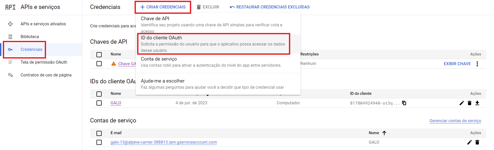
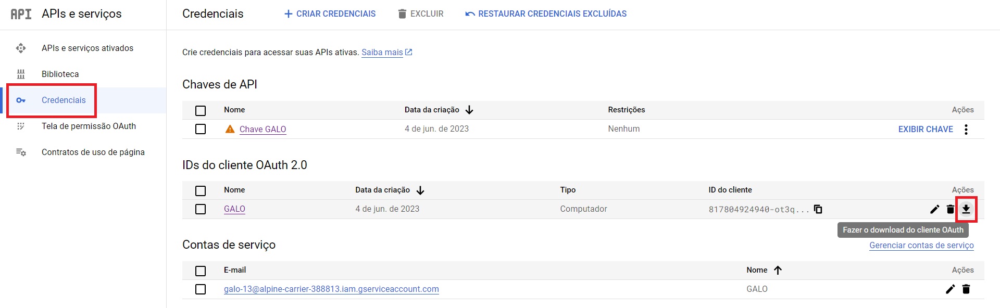

# GALO 🐔 Gerador de Análises Livre e Open-source

<a href="LICENSE"></a>

## Sobre o GALO

GALO é GALO!

<a href="./Complementos/TCC.pdf">Trabalho de Conclusão de Curso</a>

## Dependências

### Windows
```
pip install -r requirements.txt
```

### Linux
```
pip3 install -r requirements.txt
```

## Configuração

É necessário configurar 2 arquivos:
- <a href="./BDD/CFG.json">CFG.json</a>
- <a href="./BDD/GALO.json">GALO.json</a>

### CFG.json

Existem 4 campos que devem ser configurados no arquivo <a href="./BDD/CFG.json">CFG.json</a>:
- planilha_id - ID da planilha do cadastro.
- planilha_cod - Código da aba da planilha do cadastro.
- email - E-mail utilizado.
- senha - Senha gerada para aplicações de 2 fatores.

#### Senha
- Acesse <a href="https://myaccount.google.com/security">Segurança Googel</a>.
- Ative "Verificação em duas etapas".
- Ative "Pular a etapa de senha quando possível" e copie o código gerado e cole no campo de senha do arquivo <a href="./BDD/CFG.json">CFG.json</a>.


### GALO.json

- Acesse e configures a <a href="https://console.cloud.google.com/apis/library/sheets.googleapis.com">Google Sheets API</a>
- Na aba "Credenciais", clique em "+CRIAR CREDENCIAIS" e crie uma credencial "ID do Cliente OAuth".

- Baixe o arquivo .json e copie o conteúdo para dentro o arquivo <a href="./BDD/CFG.json">CFG.json</a>.


### Execução

- Execute os Módulos <a href="./Módulos/SEDE_DE_LOURDES.py">SEDE_DE_LOURDES.py</a> e <a href="./Módulos/ITATIAIA.py">ITATIAIA.py</a>
- Acesse o link que aparecerá, realize o login e a autorização de execução.

### Windows
```
python Módulos/SEDE_DE_LOURDES.py
```
```
python Módulos/ITATIAIA.py
```

### Linux
```
python3 Módulos/SEDE_DE_LOURDES.py
```
```
python3 Módulos/ITATIAIA.py
```